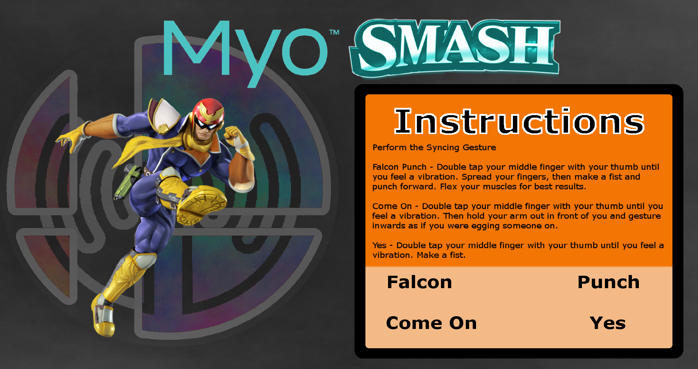

# HackIllinois Spring 2015

It may have been 10 years ago, but many college kids will- to this day- remember running around with their friends on Final Destination in the hit game *Super Smash Brothers Melee*.

### In the beginning
Our team sought out an immersive experience that would re-ignite those memories of playing this timeless fighter.  One of our team members (totally not me) took a certain pride in stubbornly refusing to play any character but the flashiest and loudest of them all: Captain Falcon.

His brand of shameless pride and hyper-aggresive playstyle is arguably the most infectuous persona in this game.

### Using the Myo
We found unspeakable joy in syncing the movesets of our favorite characters with the in-person gesture recognition provided by the Myo.  Most notably, the **Falcon Punch** never failed to grab the attention of a room of student hackers.
- - -
- - -

# Instructions
1. Configure the Myo simply by running the [main.lua](https://github.com/theshteves/myo-smash/tree/master/server/scripts) script.
2. Run the windows application [soundboard.jar](https://github.com/theshteves/myo-smash/tree/master/app).
3. As always, perform the *sync gesture* to activate the Myo while the soundboard window is open.
4. Perform any of the actions below.  You must double-tap your fingers before every unique input.
5. *Have fun!*

Hint: To switch between characters, perform the *wave-out gesture*.

#### Captain Falcon
* Falcon Punch
* Come on!
* Yes!

#### Mario
* Fireball - Double tap your middle finder with your thumb until
you feel a vibration. Spread your fingers apart to shoot a fireball.

* Jump - Double tap your middle finder with your thumb until
you feel a vibration. Raise your arm and make a fist.

* Grow -  Double tap your middle finder with your thumb until
you feel a vibration. Hold your arm out in front of you and
gesture inward as if you were tossing a mushroom into your
mouth.
- - -
- - -

## For Developers

[MYO API DOCUMENTATION](https://developer.thalmic.com/docs/api_reference/platform/script-reference.html)

[FAQ](https://developer.thalmic.com/forums/topic/255/), its nice because it tells us of how we can use the simple 5 gestures to do this

Myo unboxing [video](https://www.youtube.com/watch?v=-KSG1WesaHI), nbd

Essentially it will be easier to program on OS X:
[Here's more info on the Myo SDK](https://developer.thalmic.com/docs/api_reference/platform/the-sdk.html)

Also, I tried it's file with unity, and although I don't actually have the band synced to me or my Laptop, the program has scripts in c# already, the same ones from the files mentiones above

here is the tutorial on myo basics (https://www.thalmic.com/blog/getting-started-myo-scripts-part-1/) <- change the last number to anything from 1-6.
